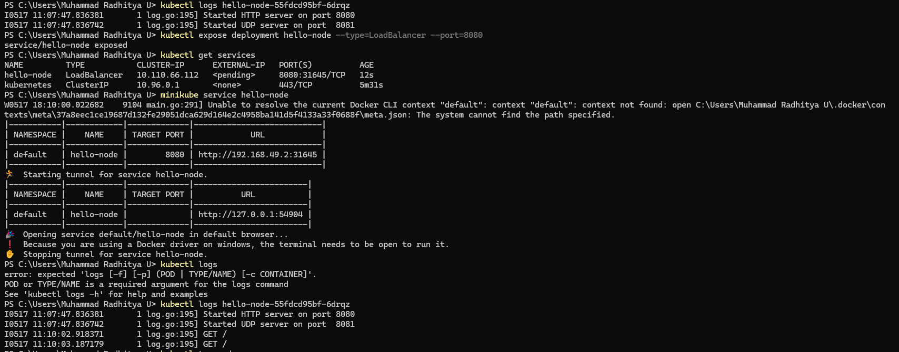

## MODULE 11
### REFLECTION
1.  Compare the application logs before and after you exposed it as a Service. Try to open the app several times while the proxy into the Service is running.
What do you see in the logs? Does the number of logs increase each time you open the app?

Before exposing the application as a service, the logs only showed startup messages indicating that the HTTP and UDP servers had started. After running kubectl expose deployment hello-node --type=LoadBalancer --port=8080, similar startup logs appeared, suggesting the application restarted. Additionally, the logs then included HTTP GET requests, indicating access attempts. While the proxy into the service was running, each time the app was opened, the logs showed a corresponding increase in the number of HTTP GET request entries. This confirmed that the service was successfully routing traffic to the application and logging each access.

2. Notice that there are two versions of `kubectl get` invocation during this tutorial section. The first does not have any option, while the latter has `-n` option with value set to `kube-system`.
What is the purpose of the `-n` option and why did the output not list the pods/services that you explicitly created?

The -n option in the kubectl command is used to specify a particular namespace in a Kubernetes cluster. In Kubernetes, namespaces are used to separate objects within the cluster so that resources are more organized and isolated. If you use the -n kube-system option, the kubectl get command will only display objects that are within the kube-system namespace. The reason the output does not explicitly display pods/services is that those resources are likely created in another namespace.